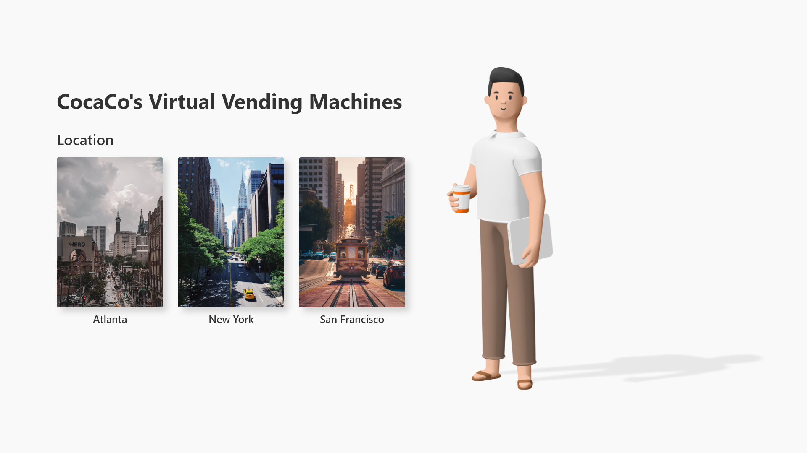

# Vending MacHine
> Simple example of a vending machine built with MongoDB, TypeScript React, SCSS, Node.js, and Express.js

Allows users to choose the vending machine they would like to use and purchase drinks virtually.



## Installation

OS X & Linux:

```sh
cd client && npm install
cd server && npm install
```
> .env is provided through email

## Development setup

Open two terminals, or split your vs code terminals and run the following two commands

```sh
cd client && npm start
cd server && nodemon server
```

## Admin API Routes

### Vending
`vending-machines/` - GET all vending machines data  
`vending-machines/:id` - GET vending machine with specific vid  
`vending-machines/add` - POST vending machine with fields { location, money, drink: { soda: SodaSchema, sodaLeft } }  
`vending-machines/update/:vid` - PUT update vending machine with specific vid  
`vending-machines/delete/:vid` - DELETE vending machine with specific vid  
`vending-machines/:vid/purchase/:did` - PUT updates vending machine with money and drinks after user purchase  
`vending-machines/:vid/refill/:did` - PUT updates vending machine's soda count when admin refills the stock. (currently only refills 10 at a time)  

### Soda
`sodas/` - GET all sodas  
`sodas/:id` - GET soda with sid  
`sodas/add` - POST adds a new soda into database  
`sodas/update/:sid` - PUT updates soda with sid  
`sodas/delete/:sid` - DELETE deletes soda with sid  


## Meta

Clifford Ng – hello@cliffordng.com
